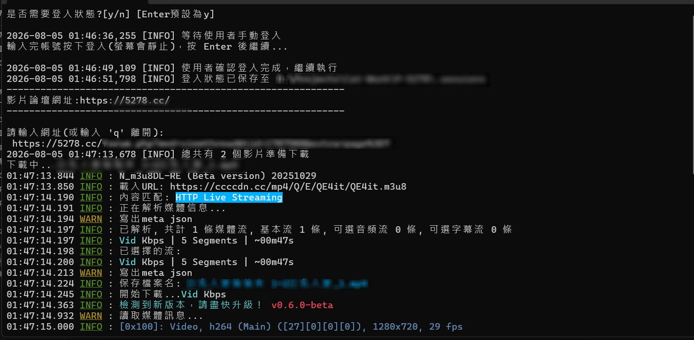

# downloader-forum-5278

自動化爬取指定影片論壇頁面中的 m3u8 串流網址，並呼叫 [N_m3u8DL-RE](https://github.com/nilaoda/N_m3u8DL-RE) 下載成 mp4。




## Requirement

```bash
pip install -r requirements.txt
```

## Usage

```bash
python main.py
```
- [!]只能在windows運行
- 第一次運行會自動安裝依賴
- 可選擇是否要登入帳號
- 貼上論壇帖子地址，等待程序動態解析取得 HLS 串流描述檔
- 登入狀態存在 `.sessions/auth.json`，之後不會再重複詢問，除非該檔案被刪除。
-若發現部分影片無法提取，可能是憑證過期，把`.sessions/auth.json`刪除，在重啟運行`main.py`，重新取得登入憑證

## 設定檔說明 (`config/config_default.yaml`)

| 欄位 | 說明 |
|---|---|
| `pre-waiting-time` | 設定秒數給瀏覽器足夠時間，載入網頁資訊 |
| `chrome.chrome_show` | 開關瀏覽器視窗 |
| `block_setting.blocked_types` | 要攔截的資源類型 |
| `block_setting.ad_domains` | 要攔截的廣告網域關鍵字 |
| `downloader_setting.thread_count` | 下載執行緒數，可看需求調整 |
| `downloader_setting.download_mode` | 模式選擇，默認下載最高畫質 |
| `downloader_setting.retry-count` | 下載失敗重試次數 |


## 已知限制 / TODO

- 目前只認 `resource_type == 'xhr'` 的 m3u8 請求，若站方改用其他載入方式（例如直接嵌在 HTML 或走 fetch 以外的資源類型）需要更新 `_handle_request`。
- 下載引擎路徑寫死為 `.exe`，僅支援 Windows；若要跨平台需依 OS 判斷抓對應的 N_m3u8DL-RE 執行檔。
- 目前為單線程逐一下載多支影片（迴圈呼叫 subprocess），沒有平行化。
- 無自動重試整體流程的機制，request 監聽抓不到 m3u8 時只會記 log 並跳過。

## Changelog

- 2026.6.6　因應網站反爬升級，調整 監聽策略。
- 2026.8.5　專案架構重構：明確分層化；行為參數抽離至 config.yaml，路徑常數集中於 config.py 管理。
